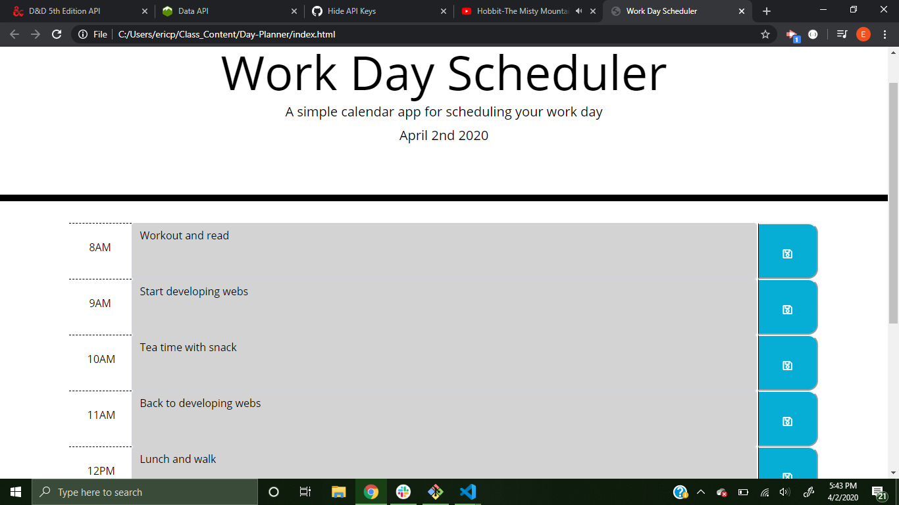

# Day-Planner
Homework 5 -> A common day planner that saves plans and updates with time of day. 
## Link to the Day Planner
https://eric-purrington.github.io/Day-Planner

## Screenshot of my workday

## How it works
Simply put in your plans for each hour, and save those plans by clicking the button on the right of each text box. 

## Languages used
The HTML and CSS was almost complete, so I didn't write much in those languages. I wrote mostly in jQuery.
### HTML
I created the time blocks with html.
### CSS
I fixed some positioning with css. 
### jQuery/Javascript
I wrote the saving function, block color change depending on time of day, and local storage items with jQuery.

## Tech used from others
The index.html and style.css was given and all but complete. On top of that these were all used within.                                                                                                    
-> Bootstrap (https://getbootstrap.com/)                                                                  
-> Fontawesome (https://fontawesome.com/)                                                          
-> Google Fonts (https://fonts.google.com/)                                              
-> jQuery (https://jquery.com/)                                              
-> Moment (https://momentjs.com/)                                      